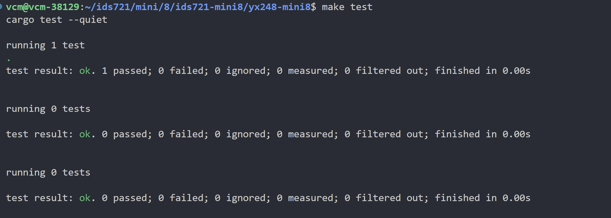

# ids721-mini8


## Create a Cargo Command-Line Tool Project

1. **Install Rust and Cargo**
Rust is a programming language, and Cargo is its package manager. To install Rust and Cargo on Ubuntu, run:

```bash
curl --proto '=https' --tlsv1.2 -sSf https://sh.rustup.rs | sh
```

This will download a script and start the installation. You'll need to follow the on-screen instructions.

2. Configure the Current Shell
After installation, configure your current shell by running:

```bash
source $HOME/.cargo/env
```

3. Create a New Cargo Project
To create a new Cargo project, use the cargo new command. You might want to start with a simple binary project:

```bash
cargo new yx248-mini8 --bin
```

This command creates a new directory named your-CLIproject with the basic structure of a Rust project.

1. Add Dependencies
Add the necessary dependencies to your Cargo.toml file:

```toml
clap = "~2.27.0"
tokio = { version = "1.36.0", features = ["macros", "full"] }
# Include other dependencies as needed
```

Always check for the latest version of these libraries.


## Implementing Your Command-Line Tool

1. Define your CLI interface and functionality in `main.rs`.
2. If your tool is complex, you might want to modularize your code by using additional files such as `lib.rs`.
3. Write your business logic and command processing in these files.

- For my function, it is based on my mini-project2 function:
[yx248-mini2 Link](https://gitlab.com/dukeaiml/IDS721/yx248-mini2)


## Build and Run the Project Local

Navigate to your project directory in the terminal and run the command-line tool with Cargo:

```bash
cargo build -release

cargo run -- --high <HIGH> --low <LOW>
```

This compiles and executes your tool with the provided command-line arguments.


## Build Docker Container

- For containerizing your CLI tool, you can build a Docker image:

```bash
# Build the Docker image
docker build -t yx248-mini8-image .

# Run your CLI tool in a Docker container
docker run --rm yx248-mini8-image --high 2 --low 1
```

The `--rm` flag automatically removes the container after it exits.

## Using Docker-Compose (Optional)

- If you need to include sensitive information or environment-specific variables (like AWS credentials) in your build, it's recommended to use a `docker-compose.yml` file along with a `.env` file.
- Here's a sample docker-compose.yml:

```yaml
version: '3.8'
services:
  yx248-mini8:
    build: .
    command: --high 2 --low 1
```

- Then run with:

```bash
docker-compose up --build
```


## Screenshots

- Here is the screenshot of my successful Docker build and run commands for CI/CD:


- Here is the screenshot of the output from running my CLI tool:


- Here is the screenshot of the successful test run:

